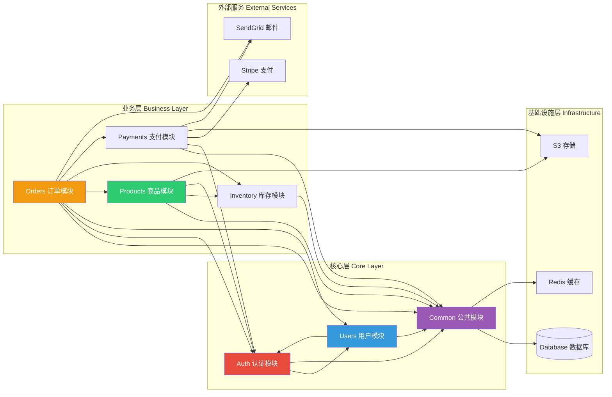
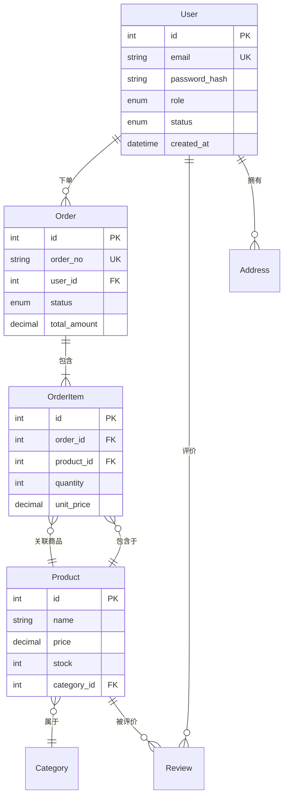
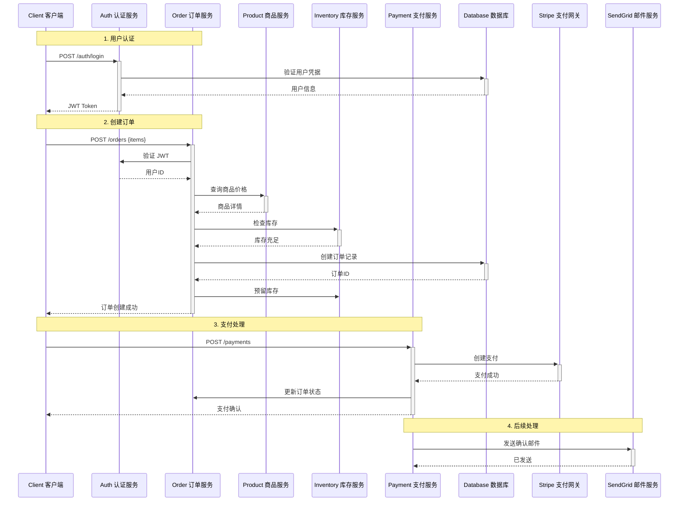
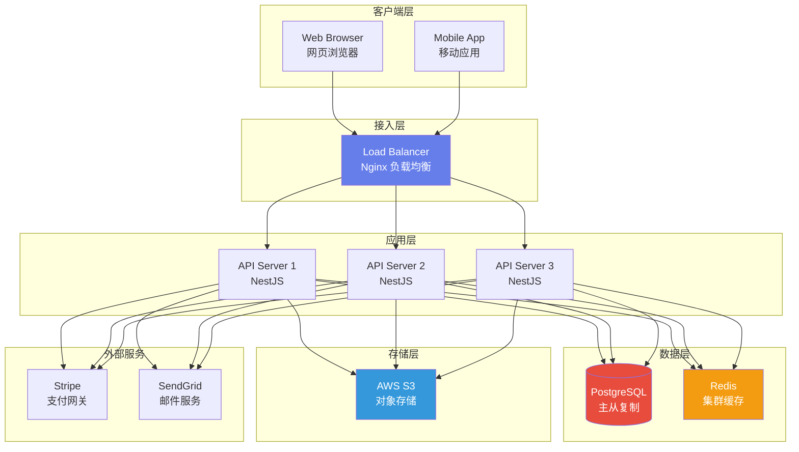

# 架构文档示例输出

> 这是 AI 分析后端代码库后生成的示例输出。

---

# 电商 API 架构文档

## 1. 概述

| 属性 | 值 |
|------|-----|
| 项目类型 | REST API（单体应用） |
| 业务领域 | 电商平台 |
| 主要语言 | TypeScript |
| 框架 | NestJS |
| 数据库 | PostgreSQL + Redis |

## 2. 技术栈

### 核心依赖
- **运行时**：Node.js 18+
- **框架**：NestJS 10.x
- **ORM**：TypeORM 0.3.x
- **数据库**：PostgreSQL 15, Redis 7
- **验证**：class-validator, class-transformer
- **认证**：JWT + Passport

### 开发工具
- **测试**：Jest, Supertest
- **代码检查**：ESLint, Prettier
- **构建**：TypeScript 编译器, Webpack

## 3. 目录结构

```
src/
├── modules/           # 功能模块
│   ├── auth/          # 认证与授权
│   ├── users/         # 用户管理
│   ├── products/      # 商品目录
│   ├── orders/        # 订单处理
│   ├── payments/      # 支付集成
│   └── inventory/     # 库存管理
├── common/            # 共享工具
│   ├── decorators/    # 自定义装饰器
│   ├── filters/       # 异常过滤器
│   ├── guards/        # 认证守卫
│   ├── interceptors/  # 响应拦截器
│   └── pipes/         # 验证管道
├── config/            # 配置文件
├── database/          # 迁移与种子数据
└── main.ts            # 应用入口
```

### 模块依赖关系



## 4. 核心模块

### 认证模块
- 基于 JWT 的身份认证
- 基于角色的访问控制（RBAC）
- 使用 bcrypt 进行密码哈希
- Refresh Token 轮换机制

### 商品模块
- 商品 CRUD 操作
- 分类管理
- 搜索与筛选
- 图片上传至 S3

### 订单模块
- 订单创建与追踪
- 状态流转管理
- 与库存系统集成
- 邮件通知

## 5. 数据架构

### 实体关系图



### 核心实体

| 实体 | 描述 | 关键字段 |
|------|------|----------|
| User | 客户账户 | id, email, role, status |
| Product | 商品信息 | id, name, price, stock |
| Order | 采购订单 | id, status, total, userId |
| OrderItem | 订单项 | id, orderId, productId, quantity |

### 数据迁移
- 位于 `src/database/migrations/`
- 执行命令：`npm run migration:run`
- 命名规范：`YYYYMMDDHHMMSS_description.ts`

## 6. API 参考

### 认证接口
| 方法 | 端点 | 描述 |
|------|------|------|
| POST | /auth/register | 创建新账户 |
| POST | /auth/login | 用户登录 |
| POST | /auth/refresh | 刷新访问令牌 |

### 商品接口
| 方法 | 端点 | 描述 |
|------|------|------|
| GET | /products | 商品列表（分页） |
| GET | /products/:id | 商品详情 |
| POST | /products | 创建商品（管理员） |
| PATCH | /products/:id | 更新商品（管理员） |

### 订单接口
| 方法 | 端点 | 描述 |
|------|------|------|
| GET | /orders | 用户订单列表 |
| POST | /orders | 创建新订单 |
| GET | /orders/:id | 订单详情 |

### 订单创建流程



## 7. 外部依赖

| 服务 | 用途 | 集成方式 |
|------|------|----------|
| AWS S3 | 文件存储 | SDK |
| Stripe | 支付处理 | SDK |
| SendGrid | 邮件发送 | API |
| Redis | 缓存、会话 | ioredis |

## 8. 配置说明

### 环境变量

| 变量名 | 必填 | 描述 |
|--------|------|------|
| DATABASE_URL | 是 | PostgreSQL 连接字符串 |
| REDIS_URL | 是 | Redis 连接字符串 |
| JWT_SECRET | 是 | Token 签名密钥 |
| AWS_ACCESS_KEY_ID | 是 | S3 访问密钥 |
| AWS_SECRET_ACCESS_KEY | 是 | S3 密钥 |
| STRIPE_SECRET_KEY | 是 | Stripe API 密钥 |

## 9. 部署考量

### 健康检查
- `/health` - 应用健康检查端点
- 数据库连接检查
- Redis 连接检查

### 扩展策略
- 无状态设计，支持水平扩展
- Redis 用于会话分发
- 数据库连接池

### 监控
- 结构化 JSON 日志
- 错误追踪（推荐 Sentry）
- 性能指标采集

### 部署架构图


